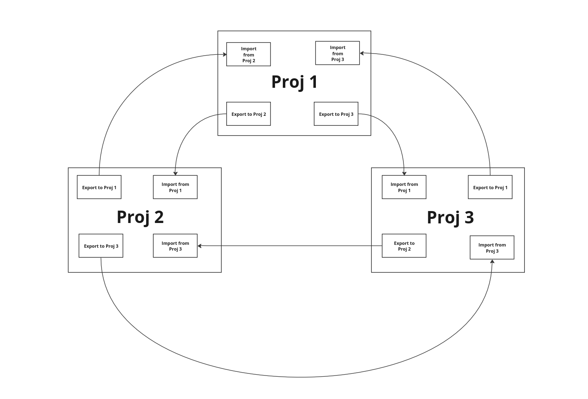

# Pulumi Circular Dependencies

This repo is a POC for solving circular dependencies in Pulumi.

The imported dependencies can be used like so:

```typescript

const value = getDependency({
  stack: 'name-of-stack'
  property: 'yourPropertyExportedFromStack',
});

```


